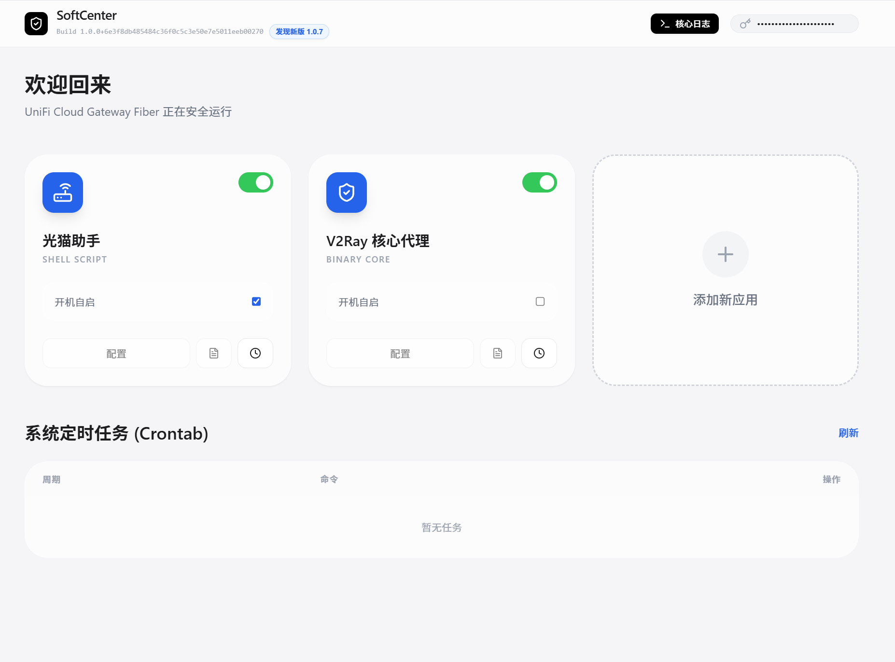

# 🚀 UniFi SoftCenter (安全管理中心)



UniFi SoftCenter 是一个专为 UniFi OS (如 UCG-Fiber) 及类 Debian 路由器系统打造的**现代化、轻量级、无依赖**的第三方应用与脚本管理中心。

它采用 **.NET 10 Native AOT** 编译后端，结合 **Vue 3 + TailwindCSS** 打造了极致流畅的 Apple-Style 毛玻璃控制面板，让路由器底层折腾变得前所未有的优雅。

## ✨ 核心功能

* **🍏 现代化 Web UI**：告别简陋的传统路由器后台，享受带有毛玻璃特效、丝滑动画体验的现代控制面板。
* **📦 极简应用管理**：支持一键启停任意底层 Shell 脚本或二进制核心程序，支持可视化配置开机自启状态。
* **⚙️ 动态参数配置**：无需通过 SSH 连接修改文件！支持底层正则解析，在 Web 弹窗中直接修改应用的底层变量参数，并自动平滑重启生效。
* **📜 极客级终端日志**：内置全屏“黑客瀑布流”日志查看器，支持实时拉取应用日志 (`tail`) 及系统核心底层守护日志 (`journalctl`)。
* **⏰ 彻底接管 Crontab**：在界面上直接管理 Linux 系统的定时任务，支持标准的 Cron 表达式添加与精准解析删除。
* **☁️ 云端应用库**：支持从 GitHub 云端 JSON 仓库一键拉取并安装适配好的软路由插件，也可手动录入本地自定义脚本配置。
* **🔄 平滑自我进化**：自带生命周期管理，支持在 Web 端探测最新版本，并通过后台脱壳 (`systemd-run`) 完成一键无感全自动下载、覆盖与重启。
* **⚡️ 极致性能与兼容性**：基于 `.NET 10 Native AOT` 交叉编译至 `linux-arm64`，单文件运行，**0 运行库依赖**。兼容老版本 `GLIBC 2.31`，即使在老旧的底层固件上也能稳定狂飙。

---

## 🚀 一键部署

请通过 SSH 登录到你的 UniFi 路由器后台（推荐使用 `root` 权限），然后复制并执行以下命令：

```bash
curl -sSL [https://raw.githubusercontent.com/fw867/unifi-softcenterstore/master/install.sh](https://raw.githubusercontent.com/fw867/unifi-softcenterstore/master/install.sh) | bash
```

💡 说明：该脚本会自动从 GitHub 拉取最新版编译好的二进制包，配置 SQLite 数据库权限，并自动向系统注册 softcenter.service 底层守护进程，开机自启自动就绪。

## 🖥️ 访问与使用


安装完成后，访问：http://<你的路由器IP>:9958

默认安全令牌 (Token)：Your_Secret_Token_Here

修改配置：可通过修改 /data/softcenter/config.json 来更改配置。修改后执行 systemctl restart softcenter.service 生效。

## 🛠️ 技术栈

Backend: C# 10 / ASP.NET Core (Minimal API) / Native AOT

Frontend: Vue 3 / TailwindCSS / Lucide Icons

Database: SQLite (Microsoft.Data.Sqlite 原生驱动)

CI/CD: GitHub Actions (使用 Ubuntu 20.04 环境编译以获得最大 GLIBC 兼容性)

📂 目录结构参考
```
/data/softcenter/
 └── bin/                        # 二进制文件目录
      └── SoftCenterManager      # 核心二进制守护进程 (Native AOT)
      └── libe_sqlite3.so        # 原生 SQLite 运行库
 ├── config.json                 # 面板端口与 Token 配置文件
 ├── manager.db                  # 应用与配置注册表数据库
 └── web/                        # 静态 Web 资源
      └── index.html             # 前端单页应用 (Vue 3)
```

## 🤝 贡献与反馈
如果您有更好的插件建议或发现了 BUG，欢迎通过 GitHub Issue 提交反馈。

项目地址: https://github.com/fw867/unifi-softcenterstore