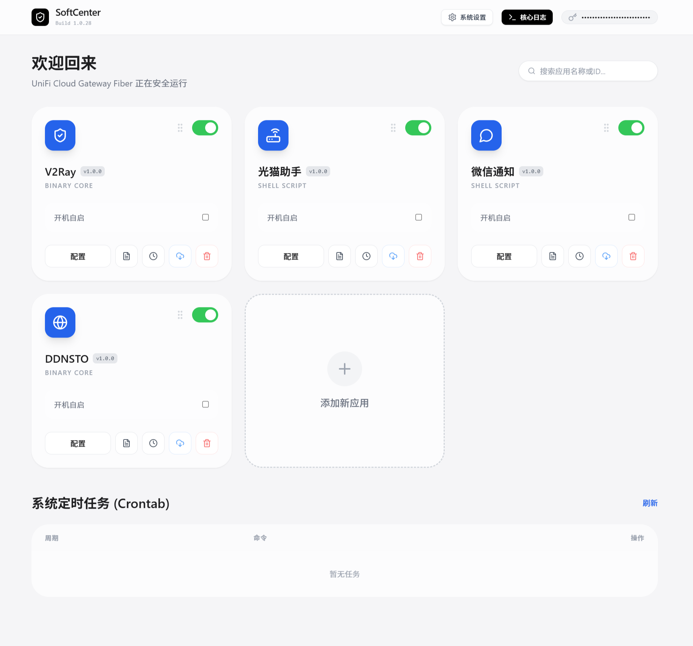

# 🚀 UniFi SoftCenter (安全管理中心)



UniFi SoftCenter 是一个专为 UniFi OS (如 UCG-Fiber) 及类 Debian 路由器系统打造的**现代化、轻量级、无依赖**的第三方应用与脚本管理中心。

它采用 **.NET 10 Native AOT** 编译后端，结合 **Vue 3 + TailwindCSS** 打造了极致流畅的 Apple-Style 毛玻璃控制面板，让路由器底层折腾变得前所未有的优雅。

## ✨ 核心杀手级功能

* **🛡️ 固件升级无损自愈 (零干预)**：独创的底层防丢钩子。即使官方推送 UniFi OS 固件更新擦除了底层 Rootfs 和守护进程，重启后 SoftCenter 也能**自动复活**，并瞬间恢复所有定时任务与自启应用。完全平替并超越 UDM-Boot！
* **🍏 现代化沉浸式 UI**：带毛玻璃特效、原生拖拽排序、全局模糊搜索，告别简陋的传统路由器后台。
* **⚙️ 全局设置 UI 化**：彻底告别 SSH！直接在 Web 面板修改访问端口、安全 Token，以及配置全局下载代理（如 V2Ray 本地节点），保存后自动平滑重启生效。
* **☁️ 云端应用库与同步**：支持从 GitHub 云端一键拉取并安装适配好的软路由插件（如光猫助手、DDNSTO、微信通知）。更支持**一键同步云端最新配置**，平滑覆盖本地参数而不丢失自启状态。
* **📦 极简应用管理**：支持一键启停任意底层 Shell 脚本或二进制核心程序，并可视化配置开机自启。
* **🛠️ Schema 驱动个性化设置页**：插件用 JSON Schema 声明配置项，面板自动渲染开关 / 下拉 / 数字 / 密码 / 多行等控件，支持分组、联动（`VisibleWhen`）与前后端双重校验。保存后写入 `/data/softcenter/config/<id>.env`，脚本 `source` 即可取参；未声明 Schema 的旧插件仍兼容 ConfigKeys 正则解析。
* **📜 极客级终端日志**：内置全屏“黑客瀑布流”日志查看器，支持实时拉取应用日志 (`tail`) 及系统核心底层守护日志 (`journalctl`)。
* **⏰ 彻底接管 Crontab**：在界面上直接管理 Linux 系统的定时任务，支持标准的 Cron 表达式添加与精准解析删除。
* **🔄 极客化在线 OTA 升级**：带实时终端日志输出的无感升级机制。自动通过配置的代理拉取最新版本，后端执行脱壳覆盖，双线程心跳探测自动刷新页面。
* **⚡️ 极致性能与兼容性**：基于 `.NET 10 Native AOT` 交叉编译至 `linux-arm64`，单文件运行，**0 运行库依赖**。兼容 `GLIBC 2.31`（UCG-Fiber / Debian 11 底层）。

---

## 🚀 一键部署

请通过 SSH 登录到你的 UniFi 路由器后台（推荐使用 `root` 权限），然后复制并执行以下命令：

**默认直连安装：**
```bash
curl -sSL https://raw.githubusercontent.com/fw867/unifi-softcenterstore/master/install.sh | bash
```

使用代理安装 (如果你在国内网络环境下载缓慢)：

代理地址可以是免费加速节点，也可以是你路由器的 V2Ray 节点。

```bash
curl -sSL https://ghp.ci/https://raw.githubusercontent.com/fw867/unifi-softcenterstore/master/install.sh | bash -s "https://ghp.ci/"
```

💡 说明：该脚本会自动从 GitHub 拉取最新版编译好的二进制包，配置 SQLite 数据库权限，注入防擦除钩子，并向系统注册 softcenter.service 底层守护进程。

## 🖥️ 访问与使用

访问地址：http://<你的路由器IP>:9958

默认令牌 (Token)：Your_Secret_Token_Here

安全建议：首次登录后，请立即点击右上角的 “系统设置” 按钮，修改默认的安全令牌 (Token) 和访问端口，也可以在其中配置全局更新代理地址（如 http://127.0.0.1:10809）。

## 🛠️ 技术栈与编译

Backend: C# 10 / ASP.NET Core (Minimal API) / Native AOT

Frontend: Vue 3 / TailwindCSS / Lucide Icons

Database: SQLite (Microsoft.Data.Sqlite 原生驱动)

CI/CD: GitHub Actions (ubuntu:20.04 容器交叉编译，目标 GLIBC 2.31，匹配 UCG-Fiber)

## 📂 核心目录结构参考

```text
/data/softcenter/
├── bin/                        # 核心程序目录
│   ├── SoftCenterManager      # 核心二进制守护进程 (Native AOT)
│   └── libe_sqlite3.so        # 原生 SQLite 运行库
├── on_boot.d/                  # SoftCenter 专属应用开机自启脚本目录
├── config.json                 # 面板端口与 Token 配置文件 (可在Web端修改)
├── config/                     # Schema 插件参数目录
│   └── <app-id>.env           # 面板写入，脚本 source
├── manager.db                  # 应用与 Cron 注册表数据库 (SQLite，含 ConfigSchema)
└── web/                        # 静态 Web 资源
    └── index.html             # 前端单页应用 (Vue 3 + Schema FormRenderer)

/data/on_boot.d/
└── 99-softcenter.sh            # 系统的底层防丢钩子 (固件升级自愈核心)
```

## 📐 ConfigSchema 编写指南（插件作者）

在 `apps/apps.json` 的应用条目里声明 `ConfigSchema`，面板会自动渲染个性化设置页：

```json
{
  "Id": "tomodem",
  "ConfigPath": "/data/softcenter/config/tomodem.env",
  "ConfigSchema": {
    "Sections": [
      {
        "Title": "网络基础",
        "Fields": [
          {
            "Key": "tomodem_ip",
            "Label": "光猫管理 IP",
            "Type": "ip",
            "Default": "192.168.1.1",
            "Required": true,
            "Help": "光猫后台地址"
          },
          {
            "Key": "tomodem_eth",
            "Label": "内网网口",
            "Type": "select",
            "Default": "eth0",
            "Options": [
              { "Label": "LAN1", "Value": "eth0" },
              { "Label": "LAN2", "Value": "eth1" }
            ]
          },
          {
            "Key": "auto_fix",
            "Label": "拨号后自动放行",
            "Type": "switch",
            "Default": "1"
          },
          {
            "Key": "udp_list",
            "Label": "UDP 端口列表",
            "Type": "text",
            "VisibleWhen": "auto_fix=1",
            "Help": "仅在开启自动放行时显示"
          }
        ]
      }
    ]
  }
}
```

### 字段类型

| Type | 控件 | 额外属性 |
|------|------|----------|
| `text` | 文本框 | `Placeholder`, `Monospace` |
| `password` | 密码框 | `Secret` |
| `number` | 数字 | `Min`, `Max` |
| `port` | 端口 | 1–65535 |
| `ip` | IP 地址 | IPv4 / IPv6 校验 |
| `path` | 路径 | `Monospace` |
| `switch` | 开关 | 存储为 `1` / `0` |
| `select` | 下拉 | `Options: [{Label, Value}]` |
| `multi-select` | 多选 | 存储为逗号分隔 |
| `textarea` | 多行 | `Rows`, `Monospace` |

通用属性：`Key`, `Label`, `Default`, `Required`, `Help`, `VisibleWhen`（如 `key=value`）。

### 脚本侧取参

保存后写入 `/data/softcenter/config/<id>.env`：

```bash
# SoftCenter generated config for tomodem
tomodem_ip=192.168.1.1
tomodem_eth=eth0
auto_fix=1
```

Shell 脚本开头直接 source：

```bash
#!/bin/bash
CONFIG=/data/softcenter/config/tomodem.env
[ -f "$CONFIG" ] && source "$CONFIG"
echo "connecting to ${tomodem_ip:-192.168.1.1} via ${tomodem_eth:-eth0}"
```

systemd 服务可用 `EnvironmentFile=/data/softcenter/config/<id>.env`。

---

## 🤝 贡献与反馈

如果您有更好的软路由插件建议、或是适配了新的应用配置，欢迎通过 GitHub PR 或 Issue 提交反馈，共同完善云端应用库！

项目地址: https://github.com/fw867/unifi-softcenterstore

