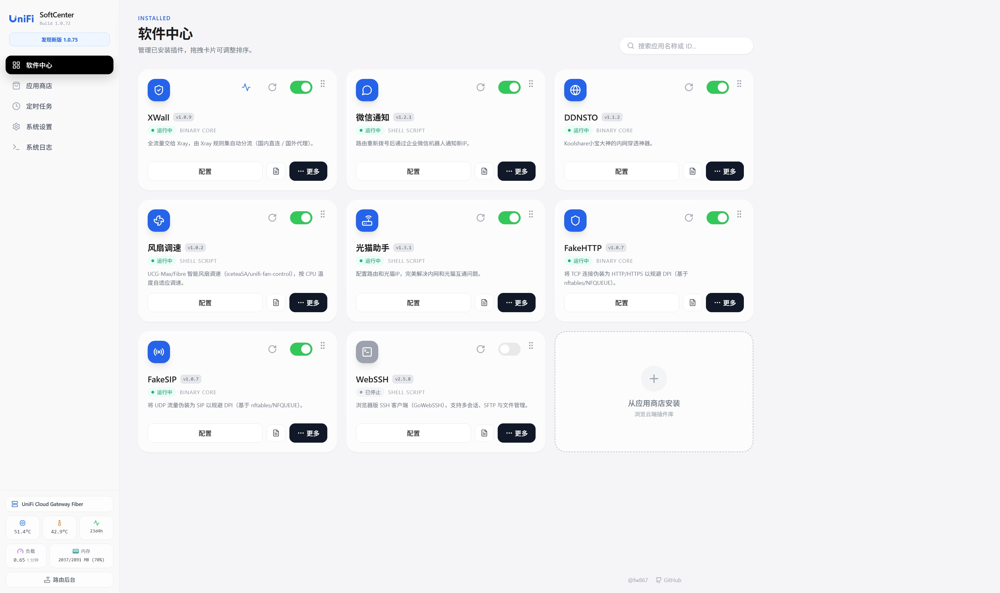

# 🚀 UniFi SoftCenter (安全管理中心)



UniFi SoftCenter 是一个专为 UniFi OS (如 UCG-Fiber) 及类 Debian 路由器系统打造的**现代化、轻量级、无依赖**的第三方应用与脚本管理中心。

它采用 **.NET 10 Native AOT** 编译后端，结合 **Vue 3 + TailwindCSS** 打造了极致流畅的 Apple-Style 毛玻璃控制面板，让路由器底层折腾变得前所未有的优雅。

## ✨ 核心杀手级功能

* **🛡️ 固件升级无损自愈 (零干预)**：独创的底层防丢钩子。即使官方推送 UniFi OS 固件更新擦除了底层 Rootfs 和守护进程，重启后 SoftCenter 也能**自动复活**，并瞬间恢复所有定时任务与自启应用。完全平替并超越 UDM-Boot！
* **🍏 现代化沉浸式 UI**：带毛玻璃特效、原生拖拽排序、全局模糊搜索，告别简陋的传统路由器后台。
* **⚙️ 全局设置 UI 化**：彻底告别 SSH！直接在 Web 面板修改访问端口、安全 Token，以及配置全局下载代理（如 V2Ray 本地节点），保存后自动平滑重启生效。
* **☁️ 云端应用库与同步**：支持从 GitHub 云端一键拉取并安装适配好的软路由插件（如光猫助手、DDNSTO、微信通知）。更支持**一键同步云端最新配置**，平滑覆盖本地参数而不丢失自启状态。
* **📦 极简应用管理**：支持一键启停任意底层 Shell 脚本或二进制核心程序，并可视化配置开机自启。
* **🛠️ Schema 驱动个性化设置页**：插件用 JSON Schema 声明配置项，面板自动渲染开关 / 下拉 / 数字 / 密码 / 多行等控件，支持分组、联动（`VisibleWhen`）与前后端双重校验。保存后写入 `/data/softcenter/config/<id>.env`，脚本 `source` 即可取参；未声明 Schema 的旧插件仍兼容 ConfigKeys 正则解析。
* **📜 极客级终端日志**：内置全屏“黑客瀑布流”日志查看器，支持实时拉取应用日志 (`tail`) 及系统核心底层守护日志 (`journalctl`)。
* **📊 插件运行状态面板（图表化）**：插件只要自带 `<id>-status` 脚本并在 `Files` 清单里声明，应用卡片就会多出一个「运行状态」按钮：面板调用 `/<id>-status --json`，把连接数、TCP/UDP 占比、TCP 状态分布、端口 Top、文件描述符与 conntrack 占用、局域网设备占用（含客户端名称与 MAC）渲染成卡片 / 进度条 / 柱状图 / 表格，每 5 秒自动刷新。XWall 插件即用此机制。
* **⏰ 彻底接管 Crontab**：在界面上直接管理 Linux 系统的定时任务，支持标准的 Cron 表达式添加与精准解析删除。
* **🔄 极客化在线 OTA 升级**：带实时终端日志输出的无感升级机制。自动通过配置的代理拉取最新版本，后端执行脱壳覆盖，双线程心跳探测自动刷新页面。
* **⚡️ 极致性能与兼容性**：基于 `.NET 10 Native AOT` 交叉编译至 `linux-arm64`，单文件运行，**0 运行库依赖**。兼容 `GLIBC 2.31`（UCG-Fiber / Debian 11 底层）。

---

## 🚀 一键部署

请通过 SSH 登录到你的 UniFi 路由器后台（推荐使用 `root` 权限），然后复制并执行以下命令：

**默认直连安装：**
```bash
curl -sSL https://raw.githubusercontent.com/fw867/unifi-softcenterstore/master/install.sh | bash
```

使用代理安装 (如果你在国内网络环境下载缓慢)：

代理地址可以是免费加速节点，也可以是你路由器的 V2Ray 节点。

```bash
curl -sSL https://ghp.ci/https://raw.githubusercontent.com/fw867/unifi-softcenterstore/master/install.sh | bash -s "https://ghp.ci/"
```

💡 说明：该脚本会自动从 GitHub 拉取最新版编译好的二进制包，配置 SQLite 数据库权限，注入防擦除钩子，并向系统注册 softcenter.service 底层守护进程。

## 🖥️ 访问与使用

访问地址：http://<你的路由器IP>:9958

默认令牌 (Token)：Your_Secret_Token_Here

安全建议：首次登录后，请立即点击右上角的 “系统设置” 按钮，修改默认的安全令牌 (Token) 和访问端口，也可以在其中配置全局更新代理地址（如 http://127.0.0.1:10809）。

## 🛠️ 技术栈与编译

Backend: C# 10 / ASP.NET Core (Minimal API) / Native AOT

Frontend: Vue 3 / TailwindCSS / Lucide Icons

Database: SQLite (Microsoft.Data.Sqlite 原生驱动)

CI/CD: GitHub Actions (ubuntu:20.04 容器交叉编译，目标 GLIBC 2.31，匹配 UCG-Fiber)

## 📂 核心目录结构参考

```text
/data/softcenter/
├── bin/                        # 插件运行文件目录（安装时下载校验写入）
│   ├── SoftCenterManager      # 核心二进制守护进程 (Native AOT)
│   ├── libe_sqlite3.so        # 原生 SQLite 运行库
│   └── <app-id>               # 各插件 shell/二进制
├── on_boot.d/                  # SoftCenter 专属应用开机自启脚本目录
├── config.json                 # 面板端口与 Token 配置文件 (可在Web端修改)
├── config/                     # Schema 插件参数目录
│   └── <app-id>.env           # 面板写入，脚本 source
├── manager.db                  # 应用与 Cron 注册表数据库 (SQLite，含 ConfigSchema/Files)
└── web/                        # 静态 Web 资源
    └── index.html             # 前端单页应用 (Vue 3 + Schema FormRenderer)

仓库侧插件源文件：
apps/
├── apps.json                   # 应用清单（含 ConfigSchema / Files+Sha256）
├── tomodem/tomodem
└── wechat/wechat

修改插件脚本后执行：pwsh tools/hash-apps.ps1  （或 ./tools/hash-apps.sh）刷新 SHA256

/data/on_boot.d/
└── 99-softcenter.sh            # 系统的底层防丢钩子 (固件升级自愈核心)
```

## 📐 ConfigSchema 编写指南（插件作者）

在 `apps/apps.json` 的应用条目里声明 `ConfigSchema`，面板会自动渲染个性化设置页：

```json
{
  "Id": "tomodem",
  "ConfigPath": "/data/softcenter/config/tomodem.env",
  "ConfigSchema": {
    "Sections": [
      {
        "Title": "网络基础",
        "Fields": [
          {
            "Key": "tomodem_ip",
            "Label": "光猫管理 IP",
            "Type": "ip",
            "Default": "192.168.1.1",
            "Required": true,
            "Help": "光猫后台地址"
          },
          {
            "Key": "tomodem_eth",
            "Label": "内网网口",
            "Type": "select",
            "Default": "eth0",
            "Options": [
              { "Label": "LAN1", "Value": "eth0" },
              { "Label": "LAN2", "Value": "eth1" }
            ]
          },
          {
            "Key": "auto_fix",
            "Label": "拨号后自动放行",
            "Type": "switch",
            "Default": "1"
          },
          {
            "Key": "udp_list",
            "Label": "UDP 端口列表",
            "Type": "text",
            "VisibleWhen": "auto_fix=1",
            "Help": "仅在开启自动放行时显示"
          }
        ]
      }
    ]
  }
}
```

### 字段类型

| Type | 控件 | 额外属性 |
|------|------|----------|
| `text` | 文本框 | `Placeholder`, `Monospace` |
| `password` | 密码框 | `Secret` |
| `number` | 数字 | `Min`, `Max` |
| `port` | 端口 | 1–65535 |
| `ip` | IP 地址 | IPv4 / IPv6 校验 |
| `time` | 时间 | HH:MM（00:00–23:59） |
| `path` | 路径 | `Monospace` |
| `switch` | 开关 | 存储为 `1` / `0` |
| `select` | 下拉 | `Options: [{Label, Value}]` |
| `multi-select` | 多选 | 存储为逗号分隔 |
| `textarea` | 多行 | `Rows`, `Monospace` |

通用属性：`Key`, `Label`, `Default`, `Required`, `Help`, `VisibleWhen`（如 `key=value`）。

### 脚本侧取参

保存后写入 `/data/softcenter/config/<id>.env`：

```bash
# SoftCenter generated config for tomodem
tomodem_ip=192.168.1.1
tomodem_eth=eth0
auto_fix=1
```

Shell 脚本开头直接 source：

```bash
#!/bin/bash
CONFIG=/data/softcenter/config/tomodem.env
[ -f "$CONFIG" ] && source "$CONFIG"
echo "connecting to ${tomodem_ip:-192.168.1.1} via ${tomodem_eth:-eth0}"
```

systemd 服务可用 `EnvironmentFile=/data/softcenter/config/<id>.env`。

### 扩展按钮（CustomCommands）注意事项

面板执行扩展命令的方式是 `/bin/bash -c "export TERM=xterm; <命令>"`，即命令被**外层双引号包裹**后交给 .NET 的
`Arguments` 解析器切成 argv。因此命令里**不能出现双引号**（外层引号会被提前闭合，命令被切成多段，只有最前面
一小段会真正执行，后面的 `if`/`tail` 等会当作位置参数被忽略，表现为"点了没反应/没有输出"），
反斜杠也会被解析器吃掉。需要引号时只用单引号，例如：

```jsonc
// ❌ 双引号会把命令截断，tail 永远不执行
"command": "echo \"级别: $(sed -n 's/^LEVEL=//p' /data/softcenter/config/x.env)\"; tail -n 50 /var/log/x.log"
// ✅ 只用单引号，或让 sed 直接输出整行
"command": "sed -n 's/^LEVEL=/级别: /p' /data/softcenter/config/x.env; tail -n 50 /var/log/x.log"
```

### 运行状态面板（`<id>-status` 脚本 + `--json`）

插件只要自带一个 `<插件ID>-status` 脚本并在 `apps.json` 的 `Files` 里声明，应用卡片上就会自动出现
**运行状态**按钮（⚡ 图标，位于重启按钮左侧）。点开后是一个图表化面板，**每 5 秒自动刷新**。

调用链：

```
点击卡片上的 ⚡
  → GET /api/apps/{id}/status_json          （面板后端，需要 Authorization 令牌）
    → 执行 /data/softcenter/bin/{id}-status --json   （20 秒超时，只接受以 { 开头的输出）
      → 你的脚本把结构化数据打到 stdout
        → 前端渲染成卡片 / 进度条 / 柱状图 / 表格
```

`Files` 声明示例（**必须**是 `<id>-status`，模式 0755，带 SHA256）：

```jsonc
{
    "Name": "myapp-status",
    "Path": "apps/myapp/myapp-status",
    "Sha256": "……",
    "Mode": "0755"
}
```

#### `Files[]` 的可选字段 `InstallOnce`

`Files` 的每一项都可以加 **`"InstallOnce": true`**（默认 `false`）：表示这个文件**装上过一次之后就不再覆盖**。

适用场景是**自带升级通道的内核**（例如客户端能自己 `-u` 升级的二进制）：首次安装/首次更新正常下载，之后商店里的「更新」只会刷新脚本与配置，不会把客户端自己升上去的内核顶回仓库里的旧版本。若确实需要换内核，卸载后重装（或手工删掉该文件）即可——下一次安装发现文件不存在，会重新下载并校验。

```jsonc
{
    "Name": "myapp-core",
    "Path": "apps/myapp/myapp-linux-arm64",
    "Sha256": "……",
    "Mode": "0755",
    "InstallOnce": true      // 只在文件不存在时安装，之后不再覆盖
}
```

#### JSON 格式

脚本 `--json` 时**只输出 JSON**（不要夹日志），下面每个字段都可省略，前端会补默认值：

```jsonc
{
  "running": true,                       // 必填。false 时面板只提示"内核未运行"+启动命令
  "time": "2026-10-05 00:10:53",         // 采集时间（显示在面板标题栏）
  "pid": "1087425",                      // 进程 PID
  "uptime": "3h24m",                     // 运行时长（可读文本）
  "mem": "38.0 MB",                      // 内存占用（可读文本）
  "mode": "1 GFWList",                   // 当前工作模式（自由文本）
  "hijack": "关", "socks": "关",          // 开关状态（自由文本）
  "dns_cn": "223.5.5.5",                 // 以下三项显示在标题栏
  "dns_foreign": "8.8.8.8",
  "loglevel": "warning",

  "total": 12,                           // 概览卡：总连接数
  "tcp": 10, "udp": 2, "other": 0,       // 协议数量

  "fd":         { "count": "42", "max": "1024", "pct": 4 },
  "conntrack":  { "count": "328", "max": "65536", "pct": 0 },

  "proto":   [ { "name": "tcp", "count": 10, "pct": "83.3" } ],
  "states":  [ { "short": "ESTAB", "name": "ESTABLISHED", "count": 8, "pct": "80.0" } ],
  "remote_ports": [ { "port": "443", "service": "https", "count": 6, "pct": "50.0" } ],
  "local_ports":  [ { "port": "1280", "service": "xwall-tcp", "count": 2, "pct": "16.7" } ],
  "lan":     [ { "ip": "192.168.1.23", "name": "XiaoMing-iPhone",
                 "mac": "a4:5e:60:1a:2b:3c", "count": 9, "pct": "100.0" } ],

  "rules":   { "nat": "就位", "mangle": "就位", "jump": "就位",
               "route": "就位", "ipset": "就位", "ipset_n": "15" },

  "verdicts": [ { "level": "ok", "text": "未见异常：连接规模 12（TCP 10 / UDP 2）" } ]
}
```

字段说明：

| 字段 | 类型 | 面板用法 |
|---|---|---|
| `running` | bool | `false` 时只显示"内核未运行"提示，其余字段忽略 |
| `total` / `tcp` / `udp` / `other` | number | 顶部概览卡与协议占比柱状图 |
| `fd` / `conntrack` | `{count,max,pct}` | 资源占用进度条；`pct` 是**数字**（不带 `%`），≥70/≥80 会变橙、≥90 变红 |
| `proto[].name` | `"tcp"/"udp"` | 颜色：udp 紫、其它蓝 |
| `states[].name` | 字符串 | 状态色：ESTABLISHED 绿、TIME-WAIT 灰、SYN-SENT/LAST-ACK 橙、CLOSE-WAIT 红 |
| `remote_ports` / `local_ports` | 数组 | 两组端口柱状图（`service` 是端口助记，如 `https`，没有就填 `-`） |
| `lan[]` | 数组 | 局域网设备表格：**IP / 客户端名称 / MAC / 会话数 / 占比**，名称与 MAC 可填 `-` |
| `rules.*` | 字符串 | 徽标：值为 **`就位`** 显示绿色，**`缺失`** 显示红色，其它值显示灰色（如 `未知`） |
| `verdicts[].level` | `ok`/`warn`/`info` | 结论配色与图标：绿 ✓ / 红 ⚠ / 蓝 ⓘ |

#### 脚本编写要点

* **必须能被 POSIX sh 解析**（路由器 `/bin/sh` 是 busybox ash，不是 bash）：不要用 `${V//pat/rep}`、`[[ ]]`、数组、`<<<`；`${V//pat/rep}` 会直接 `Bad substitution` 终止脚本。
* **只读**：诊断脚本不要改 iptables / 配置 / 进程状态。
* **快**：整个脚本要在 20 秒内跑完（超时会被后端 kill）；不要在每次调用里做大量 DNS 查询。
* **建议同时保留文本模式**：无参数时输出人类可读的 ASCII 报告，这样「扩展 → 运行状态排查」按钮和命令行都能用（参考 `apps/xwall/xwall-status`：`--json` 输出 JSON，无参数输出带柱状图的中文报告）。
* **JSON 转义**：值里出现 `"` 或 `\` 时要转义（POSIX sh 里可用 `sed -e 's/\\\\/\\\\\\\\/g' -e 's/"/\\\\"/g'` 处理，或干脆只输出安全字符）。
* **计数用整数、百分比用数字**：`"pct": 83.3`（`83.3%` 这种带百分号的字符串会让前端进度条算不出来）。

最小骨架：

```sh
#!/bin/sh
PROC_NAME="myapp-core"
if [ "${1:-}" = "--json" ]; then
    pid=$(pidof "$PROC_NAME" 2>/dev/null | awk '{print $1}')
    if [ -z "$pid" ]; then
        printf '{"running":false}\n'
        exit 0
    fi
    conn=$(ss -anp 2>/dev/null | grep -c -- "$PROC_NAME")
    printf '{"running":true,"pid":"%s","total":%s,"tcp":%s,"udp":%s,"verdicts":[{"level":"ok","text":"运行中"}]}\n' \
        "$pid" "$conn" 0 0
    exit 0
fi
printf 'MyApp 状态：运行中，连接数 %s\n' "$(ss -anp 2>/dev/null | grep -c -- "$PROC_NAME")"
```

---

## 🤝 贡献与反馈

如果您有更好的软路由插件建议、或是适配了新的应用配置，欢迎通过 GitHub PR 或 Issue 提交反馈，共同完善云端应用库！

项目地址: https://github.com/fw867/unifi-softcenterstore

